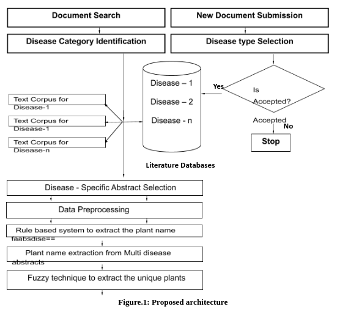
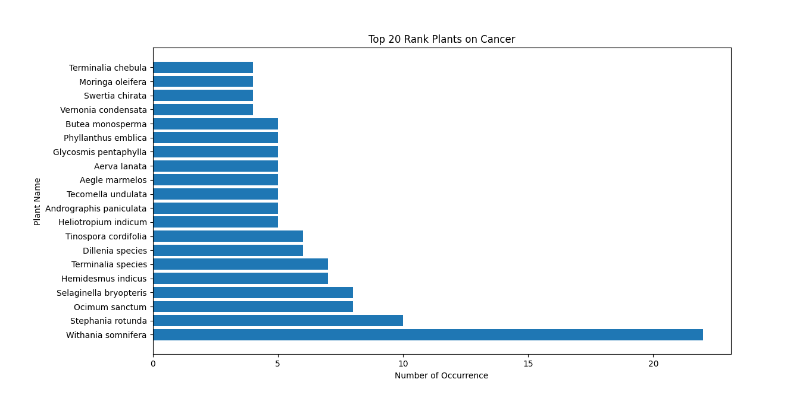
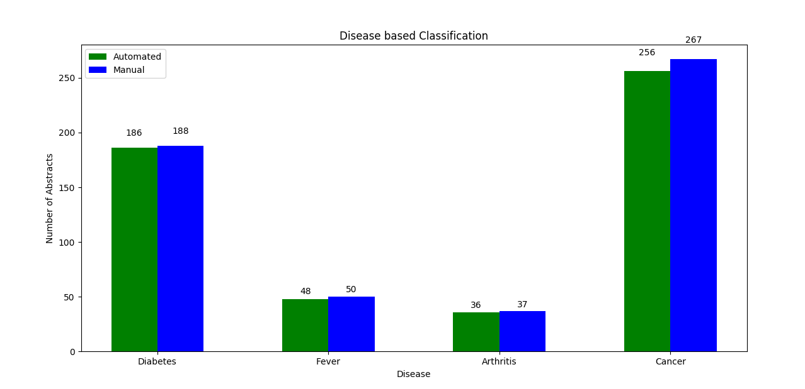
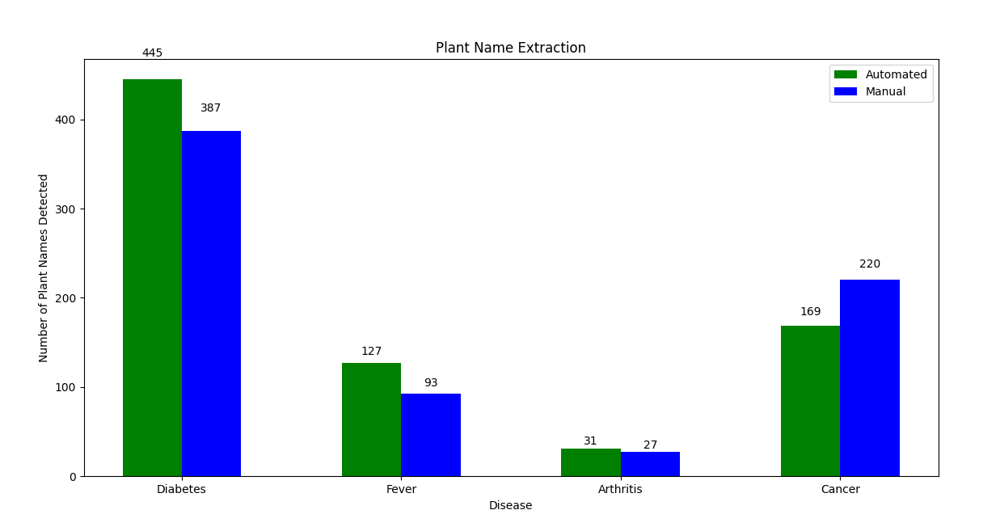
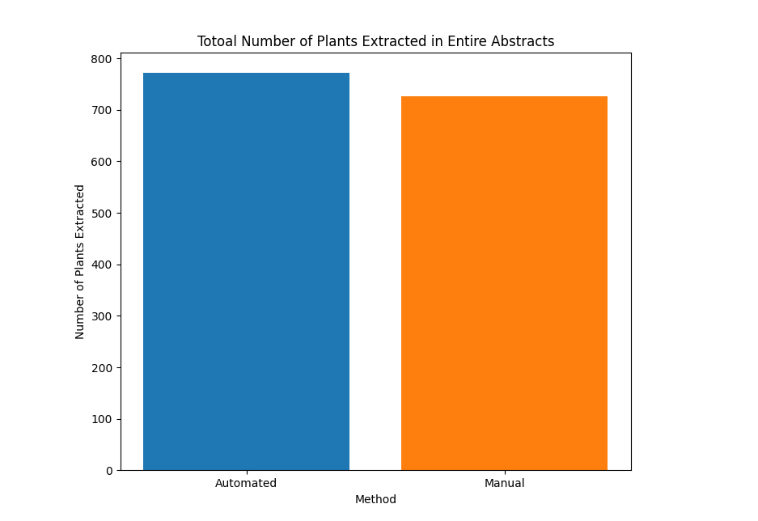

# Automatic Disease Specific Plant Text Corpora Building using Plant extraction from full text Article 

## Abstract 

Indian Medicinal plants play an important role in the treatment of various diseases disputedly
most of the medicinal plants are available as an unstructured format in biomedical literature.
Since the growth of biomedical literature tripling every year despite there is no proper text
mining tool to automatically extract the medicinal plants from the works of literature and to
automatically create the disease-specific plant corpora. Our proposed algorithm utilizes stages of the pipeline to automatically create the disease-specific plant corpus by extracting the plant
names from the multi-disease biomedical literature automatically. Our proposed model is implemented for
four diseases namely Cancer, Diabetes, Arthritis, and Fever. The proposed model is validated
using the human inputs and our model outperforms the state of art approach by scoring the
Accuracy value of 95% average for Automatic disease corpus creation and Automatic plant
extraction from biomedical works of literature abstracts and results.

#### Python Packages used in this Repository
- Numpy 
- pandas
- NLTK
- enchant

## Results

